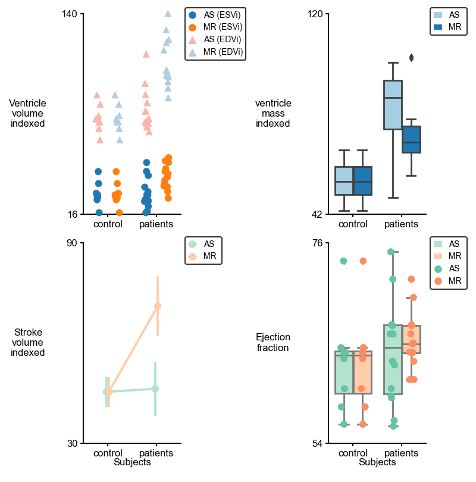

# PyCMLutilities
{:.no_toc}

## Overview 

PyCMLutil library is a suite of tools for curve-fitting, plotting, and data analysis in Python. 
This library is built upon [matplotlib](https://matplotlib.org/), [seaborn](https://seaborn.pydata.org/index.html), and [pandas](https://pandas.pydata.org/docs/reference/api/pandas.DataFrame.html) libraries.

This python-based library has been aimed to help students, faculties, or any level of researchers in visualizing stored data out of either experiments or computational simulations. 

    
    

Check [demos](pages/demos/demos.md) to get started. 
