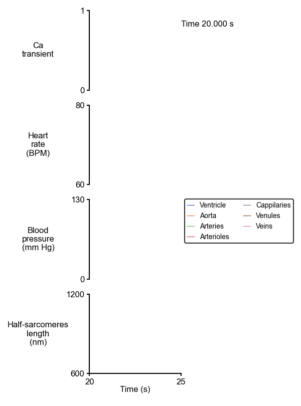
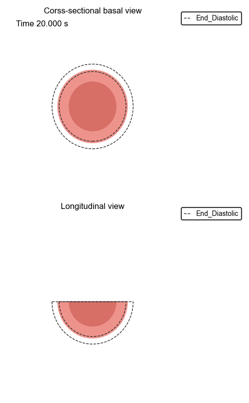

# Animation

This page introduces how to create animation from [PyMyoVent](https://campbell-muscle-lab.github.io/PyMyoVent/) software built in [Campbell Muscle Lab](https://sites.google.com/g.uky.edu/campbellmusclelab/home?authuser=0#h.p_vXOhJKhyUU9l). 


## Examples
- First import the `multi_panel_cat` function from the `PyCMLutil` library.
````python
>>> from PyCMLutil.animation.pymyovent_ventricle import animate_pymyovent as ap
````
- Then assign the path to the data spread sheet that you stored the simulated PyMyoVent results. 
````python
>>> data_path = `data/pymyovent_sample.csv`
````

**Example 1:** Animated multipanel plots.
```` python
>>> template_path = `templates/multipanel_anim.json`
>>> output_image_path = `<path_to>/multipanel_anim.gif/`
>>> ap(data_file_string = data_path,template_file_string=
... template_path, output_image_file_string= output_image_path)
````


**Example 2:** Animated 2D ventriclular shapes.
```` python
>>> template_path = `templates/2D_vent_anim.json`
>>> output_image_path = `<path_to>/2D_vent_anim.gif/`
>>> ap(data_file_string = data_path,template_file_string=
... template_path, output_image_file_string= output_image_path)
````


**Example 3:** Animated combined 2D ventricular shapes with multipanel plots.
```` python
>>> template_path = `templates/combined_anim.json`
>>> output_image_path = `<path_to>/combined_anim.gif/`
>>> ap(data_file_string = data_path,template_file_string=
... template_path, output_image_file_string= output_image_path)
````


