# Multipanel Numerical

- First import the `multi_panel` function from the `PyCMLutil` library.

````python
>>> from PyCMLutil.plots.multi_panel import multi_panel_from_flat_data as mpl
````
Below examples are based on data spreadsheets stored on the github [repository](https://github.com/Campbell-Muscle-Lab/PyCMLutilities) in the following directory path: `<github_repo>/demos/data`. **Template** files are also stored on `<github_repo>/demos/templates`.

- Then assign the path to the data spreadsheet that you want to read data from.

````python
>>> data_path = `data/test_data.xlsx`
````

**Example 1:** Calling the function without any **template** file. 
````python
>>> output_image_path = `<path_to>/no_temp.png`
>>> mpl(data_file_string = data_path,
... output_image_file_string = output_image_path)
````
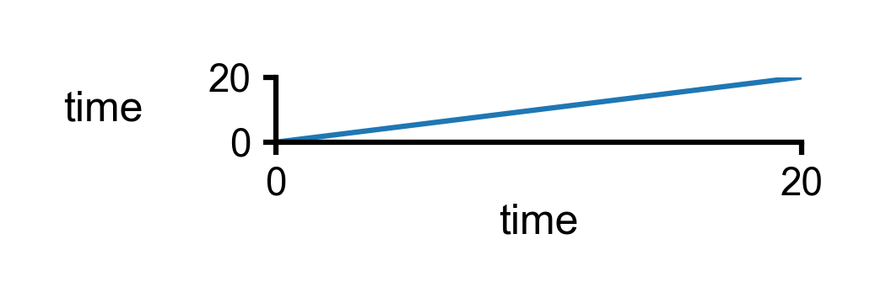

**Example 2:** 1 by 1 multipanel plot by assigning only one panel data. 

````python
>>> template_path = `templates/1X1_mpl.json`
>>> output_image_path = `<path_to>/1X1_mpl.png`
>>> mpl(data_file_string = data_path,
... template_file_string = template_path,
... output_image_file_string = output_image_path)
````
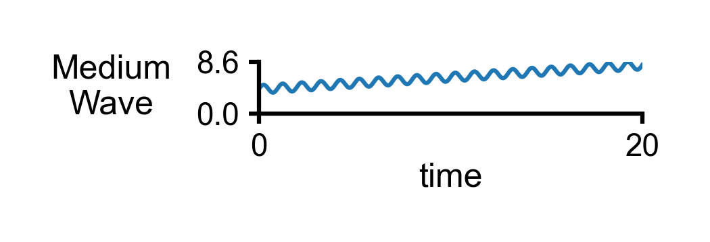

**Example 3:** 1 by 1 multipanel plot from **Example 2**, but wider. 

````python
>>> template_path = `templates/1X1_wide.json`
>>> output_image_path = `<path_to>/1X1_wide.png`
>>> mpl(data_file_string = data_path,
... template_file_string = template_path,
... output_image_file_string = output_image_path)
````


**Example 4:** 1 by 1 multipanel plot from **Example 2**, with x-axis inputs. 

````python
>>> template_path = `templates/1X1_x_display.json`
>>> output_image_path = `<path_to>/1X1_x_display.png`
>>> mpl(data_file_string = data_path,
... template_file_string = template_path,
... output_image_file_string = output_image_path)
````
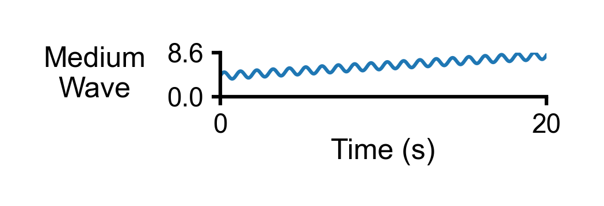

**Example 5:** 1 by 1 multipanel plot from **Example 3**, with modified height. 

````python
>>> template_path = `templates/1X1_height.json`
>>> output_image_path = `<path_to>/1X1_height.png`
>>> mpl(data_file_string = data_path,
... template_file_string = template_path,
... output_image_file_string = output_image_path)
````
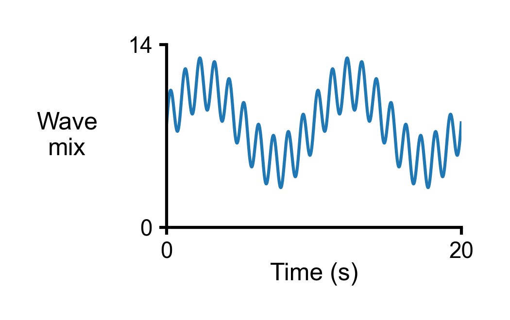

**Example 6:** 1 by 1 multipanel plot from **Example 4**, with modified x-ticks. 

````python
>>> template_path = `templates/1X1_x_ticks.json`
>>> output_image_path = `<path_to>/1X1_x_ticks.png`
>>> mpl(data_file_string = data_path,
... template_file_string = template_path,
... output_image_file_string = output_image_path)
````
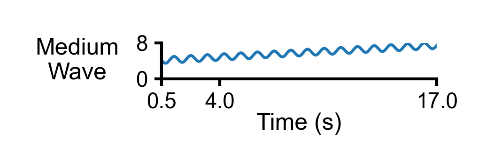

**Example 7:** 1 by 2 multipanel plots. 

````python
>>> template_path = `templates/1X2_wide.json`
>>> output_image_path = `<path_to>/1X2_wide.png`
>>> mpl(data_file_string = data_path,
... template_file_string = template_path,
... output_image_file_string = output_image_path)
````
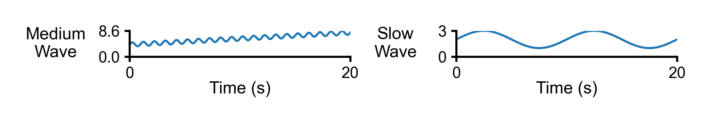

**Example 8:** 1 by 3 multipanel plots. 

````python
>>> template_path = `templates/1X3_wide.json`
>>> output_image_path = `<path_to>/1X3_wide.png`
>>> mpl(data_file_string = data_path,
... template_file_string = template_path,
... output_image_file_string = output_image_path)
````
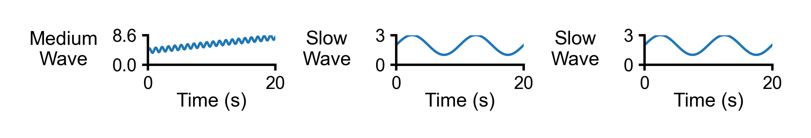

**Example 9:** 1 by 3 multipanel plots with different types of scaling for y-axis. 

````python
>>> template_path = `templates/1X3_wide_scaling.json`
>>> output_image_path = `<path_to>/1X3_wide_scaling.png`
>>> mpl(data_file_string = data_path,
... template_file_string = template_path,
... output_image_file_string = output_image_path)
````
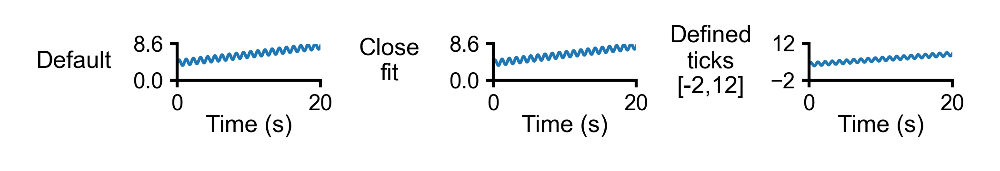

**Example 10:** 1 by 2 multipanel plots with second plot showing the envlope of responses. 

````python
>>> template_path = `templates/1X2_envelope.json`
>>> output_image_path = `<path_to>/1X2_envelope.png`
>>> mpl(data_file_string = data_path,
... template_file_string = template_path,
... output_image_file_string = output_image_path)
````
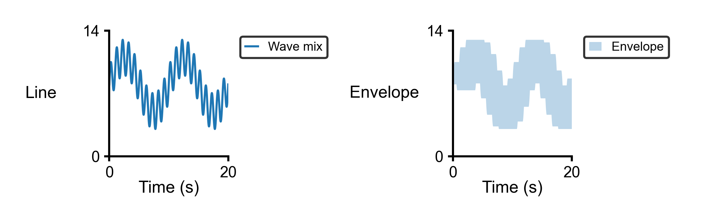

**Example 11:** partial 2 by 2 multipanel plots. 

````python
>>> template_path = `templates/2X2_partial.json`
>>> output_image_path = `<path_to>/2X2_partial.png`
>>> mpl(data_file_string = data_path,
... template_file_string = template_path,
... output_image_file_string = output_image_path)
````
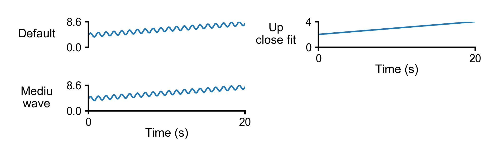

**Example 12:** Full 2 by 2 multipanel plots. 

````python
>>> template_path = `templates/2X2_full.json`
>>> output_image_path = `<path_to>/2X2_full.png`
>>> mpl(data_file_string = data_path,
... template_file_string = template_path,
... output_image_file_string = output_image_path)
````
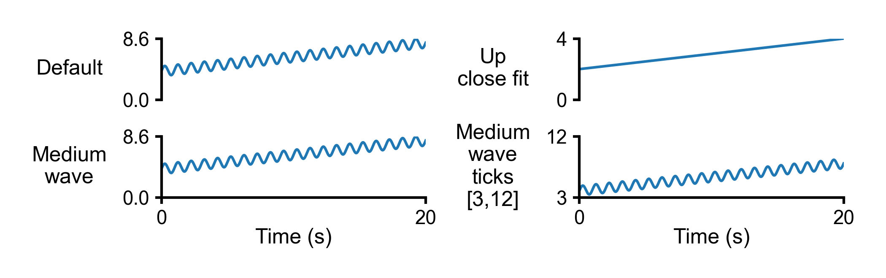

**Example 13:** 2 by 2 multipanel plots with multi series. 

````python
>>> template_path = `templates/2X2_multi_series.json`
>>> output_image_path = `<path_to>/2X2_multi_series.png`
>>> mpl(data_file_string = data_path,
... template_file_string = template_path,
... output_image_file_string = output_image_path)
````
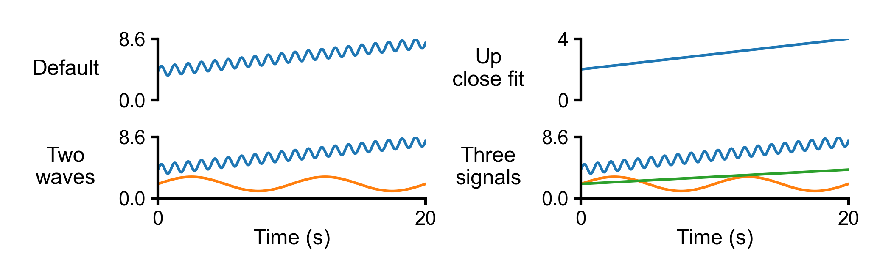

**Example 14:** 2 by 2 multipanel plots with multi series and labels. 

````python
>>> template_path = `templates/2X2_multi_series_labels.json`
>>> output_image_path = `<path_to>/2X2_multi_series_labels.png`
>>> mpl(data_file_string = data_path,
... template_file_string = template_path,
... output_image_file_string = output_image_path)
````
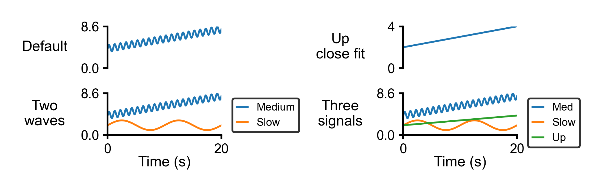

**Example 15:** Partial 2 by 2 multipanel plots with one panel showing envelope of responses. 

````python
>>> template_path = `templates/2X2_envelope_partial.json`
>>> output_image_path = `<path_to>/2X2_envelope_partial.png`
>>> mpl(data_file_string = data_path,
... template_file_string = template_path,
... output_image_file_string = output_image_path)
````
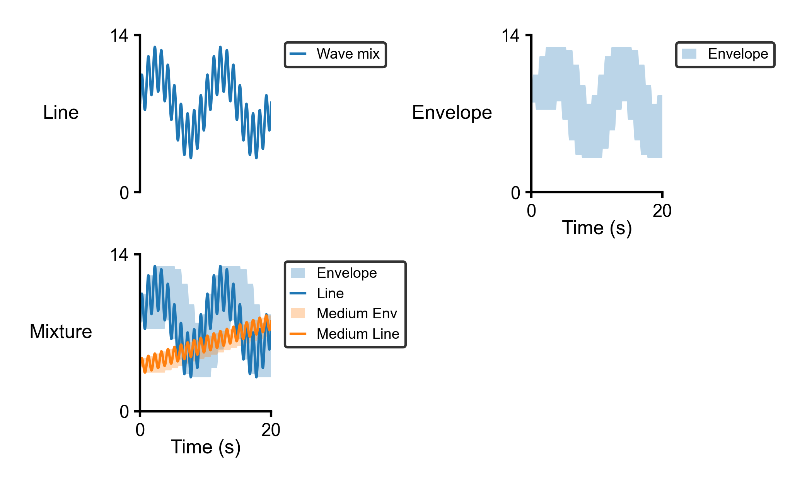

**Example 16:** 2 by 2 multipanel plots with mix of previous examples. 

````python
>>> template_path = `templates/2X2_mix.json`
>>> output_image_path = `<path_to>/2X2_mix.png`
>>> mpl(data_file_string = data_path,
... template_file_string = template_path,
... output_image_file_string = output_image_path)
````
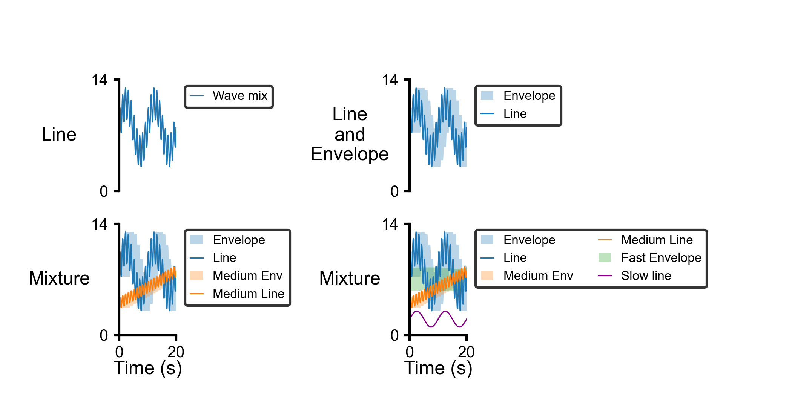

**Example 17:** 5 by 2 multipanel plots. 

````python
>>> template_path = `templates/5X2_mpl.json`
>>> output_image_path = `<path_to>/5X2_mpl.png`
>>> mpl(data_file_string = data_path,
... template_file_string = template_path,
... output_image_file_string = output_image_path)
````
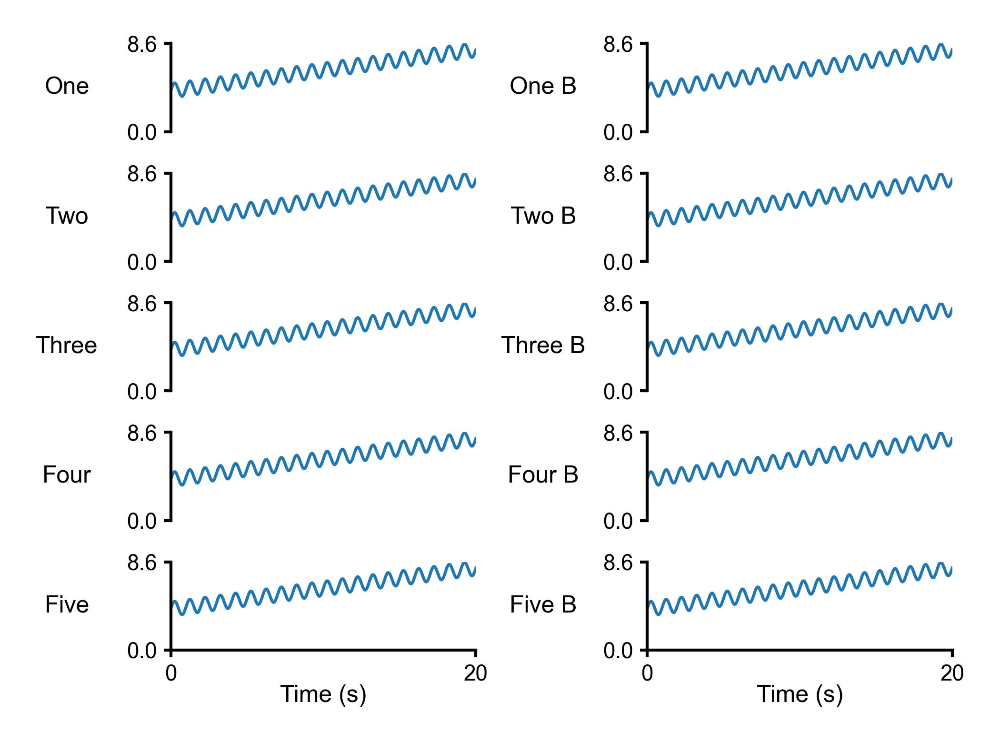

**Example 18:** 5 by 2 multipanel plots with margins. 

````python
>>> template_path = `templates/5X2_margins.json`
>>> output_image_path = `<path_to>/5X2_margins.png`
>>> mpl(data_file_string = data_path,
... template_file_string = template_path,
... output_image_file_string = output_image_path)
````
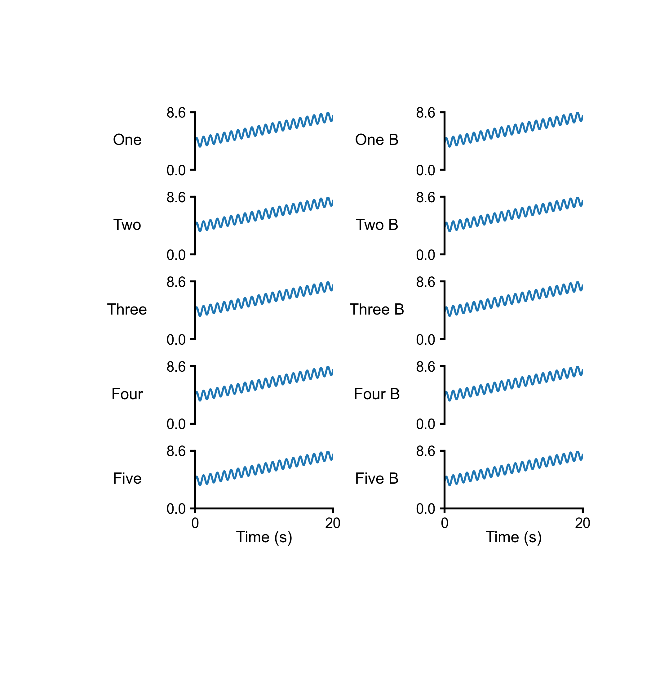

**Example 19:** Multipanel plots from **Example 16** with multi annotations. 

````python
>>> template_path = `templates/2X2_mix_annotate.json`
>>> output_image_path = `<path_to>/2X2_mix_annotate.png`
>>> mpl(data_file_string = data_path,
... template_file_string = template_path,
... output_image_file_string = output_image_path)
````
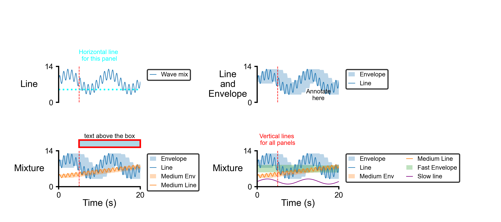

**Example 20:** A more complicated multipanel plots for a [PyMyoVent](https://campbell-muscle-lab.github.io/PyMyoVent/) simulation. 

````python
>>> data_path = `data/pymyovent_test.csv`
>>> template_path = `templates/pymyovent.json`
>>> output_image_path = `<path_to>/pymyovent.png`
>>> mpl(data_file_string = data_path,
... template_file_string = template_path,
... output_image_file_string = output_image_path)
````
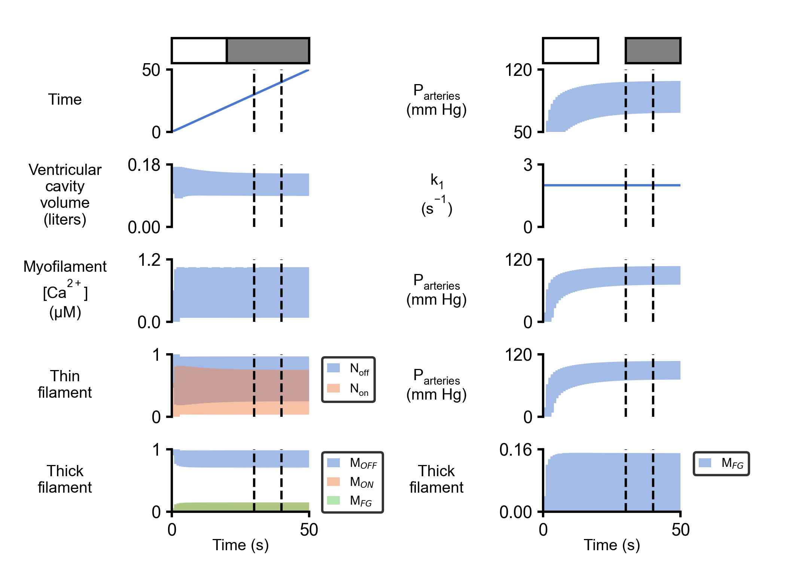