# Multipanel

## Overview

The [multipanel module](https://github.com/Campbell-Muscle-Lab/PyCMLutilities/blob/main/plots/multi_panel.py) creates figures with panels showing 1 or more columns from a flat data file.

The code takes 3 inputs:
+ an Excel file
+ a structure file written in JSON format
+ an output image file

For example

````
multi_panel_from_flat_data(
    excel_file_string = 'test.xlsx',
    template_file_string = 'template.json',
    output_image_file_string = 'image.png')
````

The images below were generated from the same excel file by passing in the templates stored in `<repo>/demos/demos_plots/demos_multi_panel/json`.

## Example template

Template files lay out the structure in JSON format. You can over-write the default layouts and formatting by adding fields to the layout{} and formatting{} sections.

Every panel is defined with a column number. The number of panel columns is the largest column number in the template. Panels are added sequentially to each column. The number of panel rows in the figure is the number of panels in the longest column.

Here is an example file (2x2_envelope) that includes most of the current features.

````
{
    "layout":
    {
        "fig_width": 7,
        "panel_height": 2,
        "top_margin": 0.5,
        "right_margin": 0.5
    },
    "formatting":
    {
        "tick_fontsize": 10    
    },
    "x_display":
    {
        "global_x_field": "time",
        "label": "Time (s)"
    },
    "panels":
    [
        {
            "column": 1,
            "y_info":
            {
                "label": "Line",
                "series":
                [
                    {
                        "field": "wave_mix",
                        "field_label": "Wave mix"
                    }
                ]
            }
        },
        {
            "column": 2,
            "y_info":
            {
                "label": "Line\nand\nEnvelope",
                "series":
                [
                    {
                        "field": "wave_mix",
                        "style": "envelope",
                        "field_label": "Envelope"
                    },
                    {
                        "field": "wave_mix",
                        "field_label": "Line"
                    }
                ]
            }
        },
        {
            "column": 1,
            "y_info":
            {
                "label": "Mixture",
                "series":
                [
                    {
                        "field": "wave_mix",
                        "style": "envelope",
                        "field_label": "Envelope"
                    },
                    {
                        "field": "wave_mix",
                        "field_label": "Line"
                    },
                    {
                        "field": "medium_wave",
                        "style": "envelope",
                        "field_label": "Medium Env"
                    },
                    {
                        "field": "medium_wave",
                        "field_label": "Medium Line"
                    }
                ]
            }
        },
        {
            "column": 2,
            "y_info":
            {
                "label": "Mixture",
                "series":
                [
                    {
                        "field": "wave_mix",
                        "style": "envelope",
                        "field_label": "Envelope"
                    },
                    {
                        "field": "wave_mix",
                        "field_label": "Line"
                    },
                    {
                        "field": "medium_wave",
                        "style": "envelope",
                        "field_label": "Medium Env"
                    },
                    {
                        "field": "medium_wave",
                        "field_label": "Medium Line"
                    },
                    {
                        "field": "fast_wave",
                        "style": "envelope",
                        "field_label": "Fast Envelope"
                    }
                ]
            }
        }
    ]
}
````

## Demo

+ Open a python prompt
+ Change directory to the repo base directory
+ `python PyCMLutil.py

The images below should be written to `<repo>/demos/demos_plots/demos_multi_panel/temp`

## Output

***

### Default - no layout
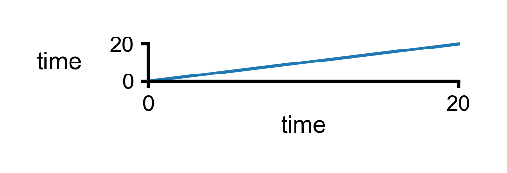

***

### 1 x 1
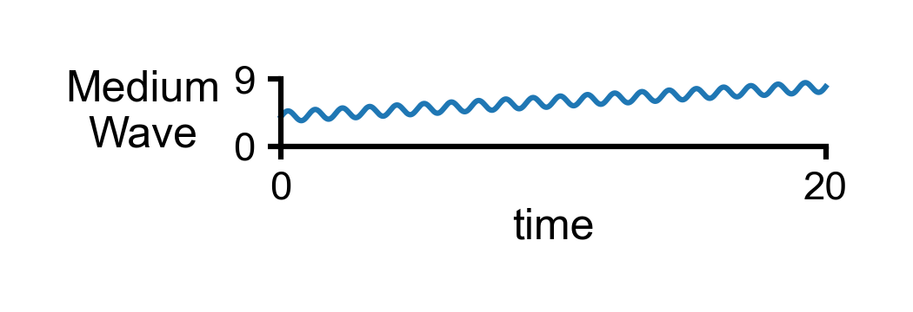

***

### 1 x 1 wide


***

### 1 x 1 x-display
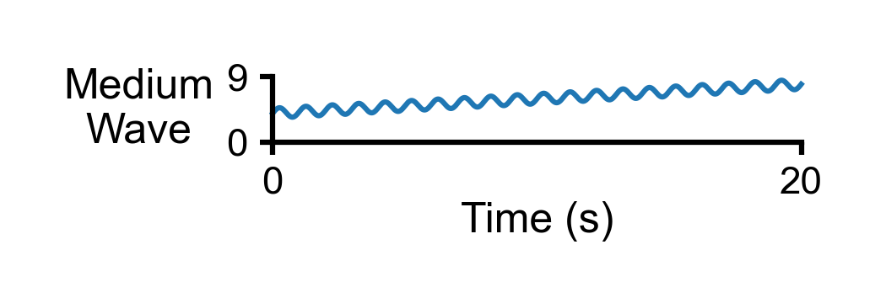

***

### 1 x 1 height
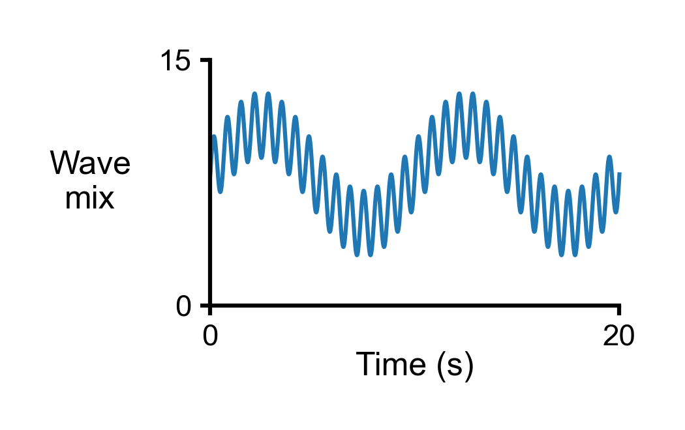

***

### 1 x 1 x-ticks
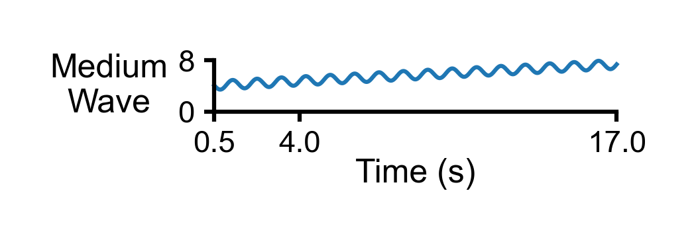

***

### 1 x 2 wide
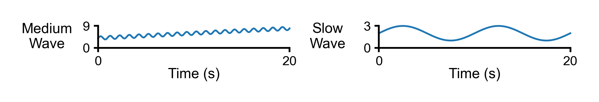

***

### 1 x 3 wide
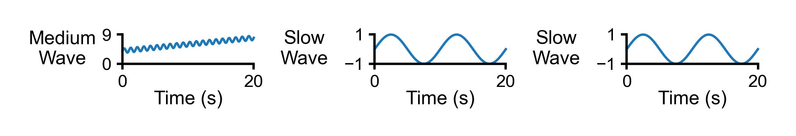

***

### 1 x 3 wide scaling
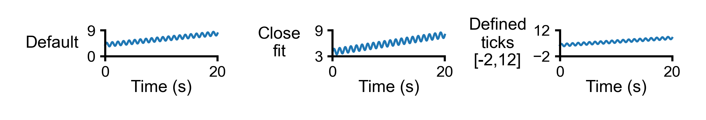

***

### 1 x 2 envelope
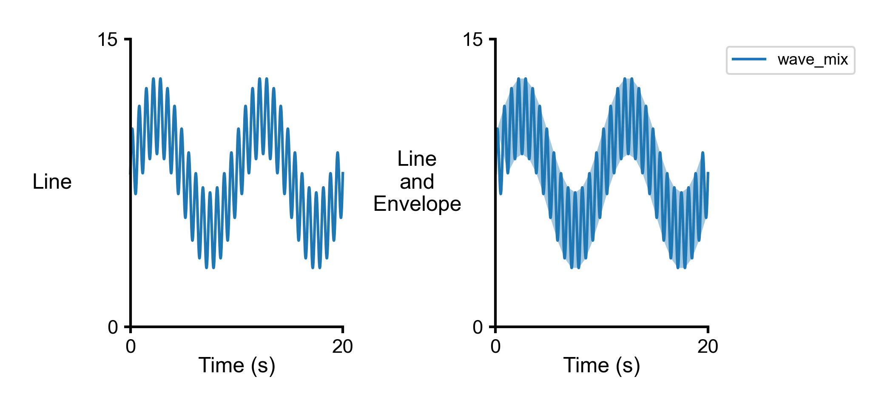

***

### 2-2 partial
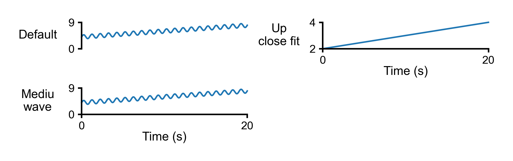

***

### 2 x 2
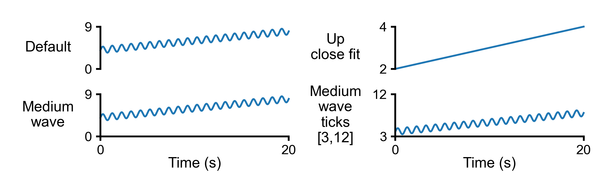

***

### 2 x 2 multi-series
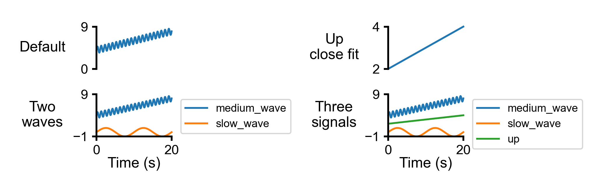

***

### 2 x 2 multi-series labels
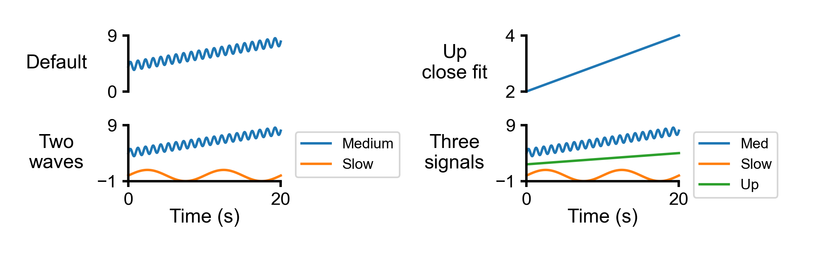

***

### 2 x 2 envelope partial
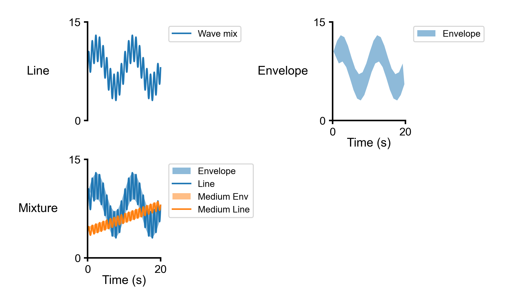

***

### 2 x 2 envelope
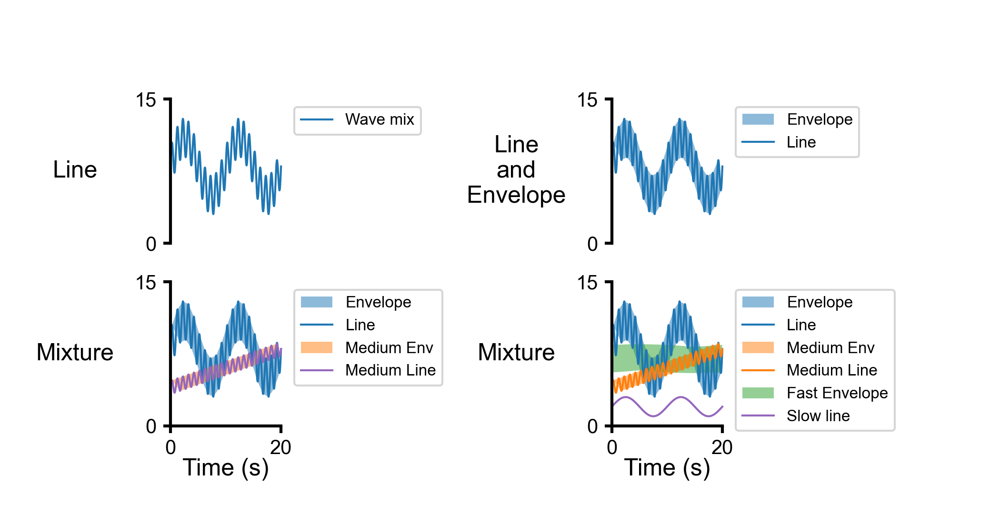

***

### 5 x 2
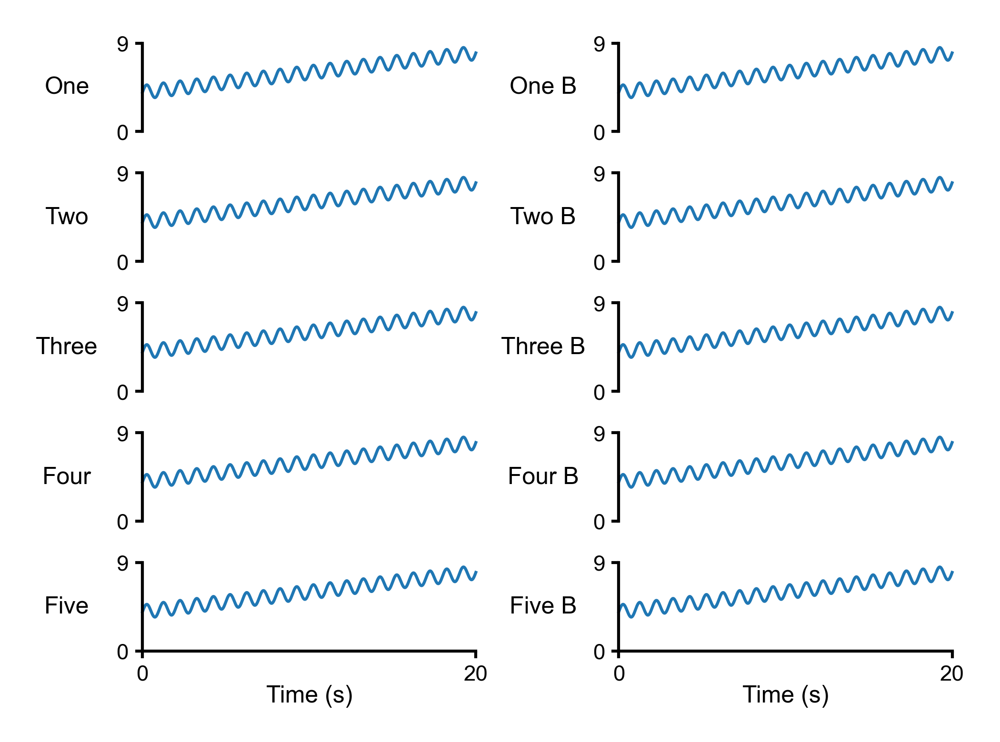

***

### 5 x 2 margins
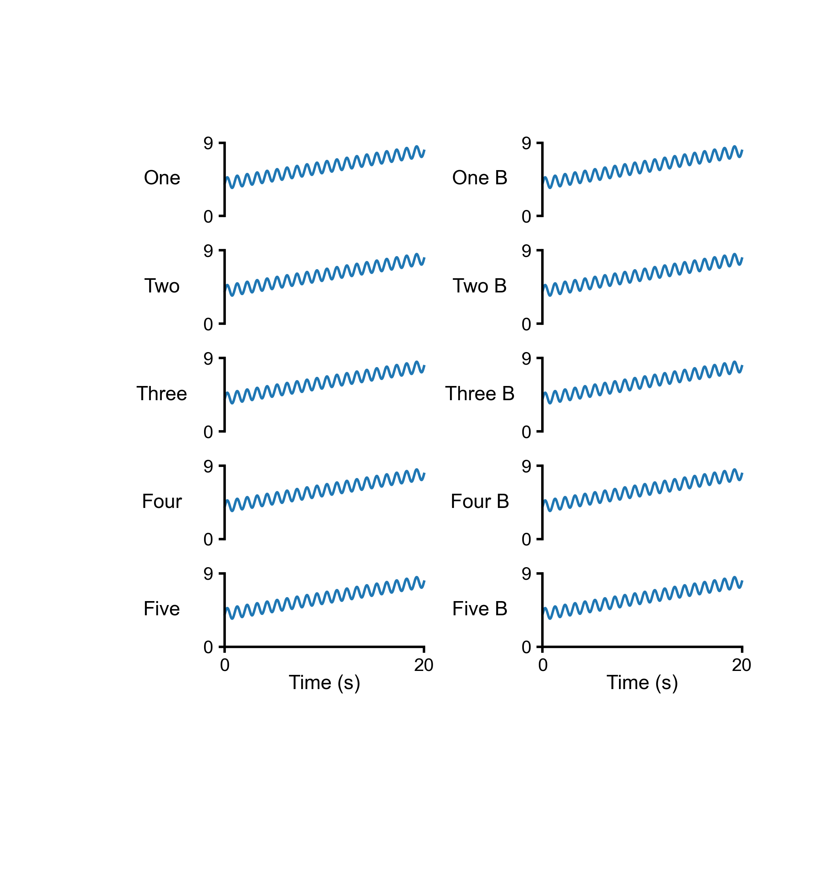

***

### Annotate plots
See `annotate_plot()` in `<repo>/demos/demos_plots/demos_multi_panel/demos_multi_panel_code.py` for a demonstration of how to annotate a figure
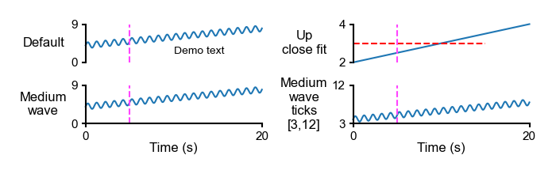
