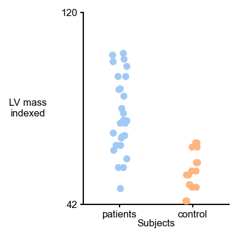
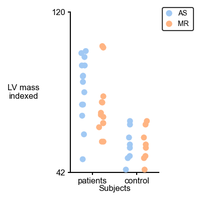
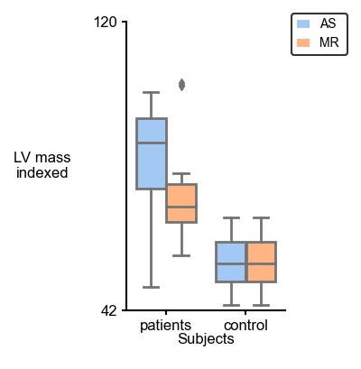
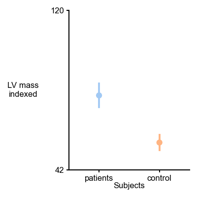
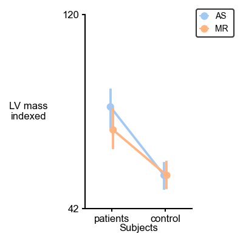
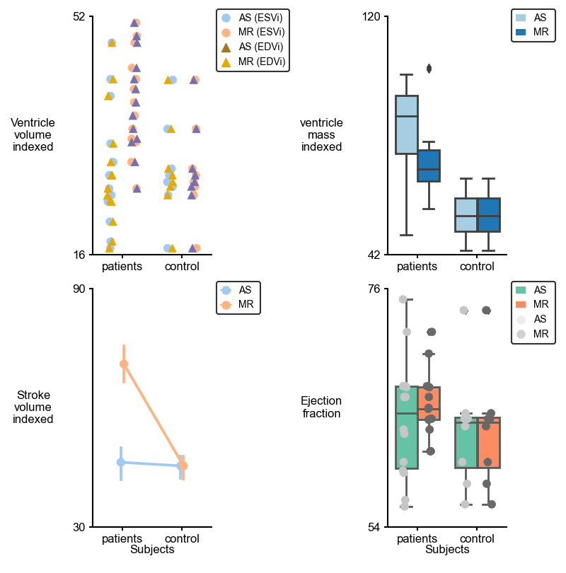

# Categorical

## Overview
This python function is useful for plotting multipanel plots in which   one axis shows a numerical variable and the other axis shows a categorical variable. So far, this function supports three categorical plots of [seaborn](https://seaborn.pydata.org/index.html) library as follows. 

1. [stripplot()](https://seaborn.pydata.org/generated/seaborn.stripplot.html#seaborn.stripplot)
The following inputs for `stripplot` can be changed by defining them in the `strip_formatting` section of the **template** file. 
- **jitter**: `jitter` parameter as is explained by [seaborn](https://seaborn.pydata.org/generated/seaborn.stripplot.html#seaborn.stripplot).
- **dodge**: `dodge` parameter as is explained by [seaborn](https://seaborn.pydata.org/generated/seaborn.stripplot.html#seaborn.stripplot).
- **marker_ec**: `edgecolor` parameter as is explained by [seaborn](https://seaborn.pydata.org/generated/seaborn.stripplot.html#seaborn.stripplot).
- **marker_elw**: `linewidthfloat` parameter as is explained by [seaborn](https://seaborn.pydata.org/generated/seaborn.stripplot.html#seaborn.stripplot).
- **marker_size**: `size` parameter as is explained by [seaborn](https://seaborn.pydata.org/generated/seaborn.stripplot.html#seaborn.stripplot).

2. [boxplot()](https://seaborn.pydata.org/generated/seaborn.boxplot.html#seaborn.boxplot)
The following inputs for `boxplot` can be changed by defining them in the `box_formatting` section of the **template** file. 
- **color_saturation**: `saturation` parameter as is explained by [seaborn](https://seaborn.pydata.org/generated/seaborn.boxplot.html#seaborn.boxplot).
- **dodge**: `dodge` parameter as is explained by [seaborn](https://seaborn.pydata.org/generated/seaborn.boxplot.html#seaborn.boxplot).
- **linewidth**: `linewidth`parameter as is explained by [seaborn](https://seaborn.pydata.org/generated/seaborn.boxplot.html#seaborn.boxplot).
- **box_width**: `width` parameter as is explained by [seaborn](https://seaborn.pydata.org/generated/seaborn.boxplot.html#seaborn.boxplot).


3. [pointplot()](https://seaborn.pydata.org/generated/seaborn.pointplot.html#seaborn.pointplot)
The following inputs for `pointplot` can be changed by defining them in the `point_formatting` section of the **template** file.
- **confidence_int**: `ci` parameter as is explained by [seaborn](https://seaborn.pydata.org/generated/seaborn.pointplot.html#seaborn.pointplot).
- **estimator**: `estimator` parameter as is explained by [seaborn](https://seaborn.pydata.org/generated/seaborn.pointplot.html#seaborn.pointplot).
- **dodge**: `dodge` parameter as is explained by [seaborn](https://seaborn.pydata.org/generated/seaborn.pointplot.html#seaborn.pointplot).
- **join**: `join` parameter as is explained by [seaborn](https://seaborn.pydata.org/generated/seaborn.pointplot.html#seaborn.pointplot).
- **errwidth**: `errwidth` parameter as is explained by [seaborn](https://seaborn.pydata.org/generated/seaborn.pointplot.html#seaborn.pointplot).
- **capsize**: `capsize` parameter as is explained by [seaborn](https://seaborn.pydata.org/generated/seaborn.pointplot.html#seaborn.pointplot).

## Note
The following parameters can be changed for all types of categorical plots. 
- **palette**: `palette` parameter as is explained by [seaborn](https://seaborn.pydata.org/generated/seaborn.stripplot.html#seaborn.stripplot). It can be adjusted in each sub-section of `y_info` in the **template** file. 
- **x_order**: `order` parameter as is explained by [seaborn](https://seaborn.pydata.org/generated/seaborn.stripplot.html#seaborn.stripplot). It can be defined for each panel data in the **template** file. 
- **hue_order**: `hue_order` parameter as is explained by [seaborn](https://seaborn.pydata.org/generated/seaborn.stripplot.html#seaborn.stripplot). It can be defined for each panel data in the **template** file. 
- For **stripplot** and **pointplot**, the marker size for each sub-section of `y_info` in the **template** file can be assigned manually by the user. Otherwise, it will be assigned by the default list of marker that can be changed in the `strip_formatting` section of the **template** file. Default marker list is :
`strip_formatting['marker_list'] = ['o','^','s','x','*']`
## Function
````
PyCMLutil.plots.multi_panel_cat.multi_panel_cat_from_flat_data(
        data_file_string = [],
        excel_sheet = 'Sheet1',
        pandas_data = [],
        template_file_string=[],
        output_image_file_string = [],
        dpi = 300)
````


**Parameters:**
- **data_file_string : str, optional**
    Path to the data file (either in format of csv or xlsx). The default is [].
- **excel_sheet : str, optional**
    Excel sheet where the data are stored. The default is *Sheet1*. 
- **pandas_data : Pandas DataFrame, optional**
    DataFrame containing the data. The default is [].
- **template_file_string : str, optional**
    Path to the .json structure file. The default is [].
- **output_image_file_string : str, optional**
    Path where the output plot is saved. The default is [].
- **dpi : int, optional**
    Image resolution. The default is 300.

**Returns:**
- **figure :**
    Handle to the produced pyplot figure.
- **ax :**
     Handle to an array of the pyplot axes.
## Examples
- First import the `multi_panel_cat` function from the `PyCMLutil` library.
````python
>>> from PyCMLutil.plots.multi_panel_cat import multi_panel_cat_from_flat_data as mplc
````
- Then assign the path to the data spread sheet that you want to read data from.
````python
>>> data_path = `data/valvular_disease.xlsx`
````
**Example 1:** 1 by 1  multipanel stripplot.
```` python
>>> template_path = `templates/1X1_strip_valvular.json`
>>> output_image_path = `<path_to>/1X1_strip_valvular.png/`
>>> mplc(data_file_string = data_path,template_file_string=
... template_path, output_image_file_string= output_image_path)
````


**Example 2:** 1 by 1  multipanel stripplot with hue.
```` python
>>> template_path = `templates/1X1_strip_hue_valvular.json`
>>> output_image_path = `<path_to>/1X1_strip_hue_valvular.png/`
>>> mplc(data_file_string = data_path,template_file_string= 
... template_path, output_image_file_string= output_image_path)
````


**Example 3:** 1 by 1  multipanel boxplot.
```` python
>>> template_path = `templates/1X1_box_valvular.json`
>>> output_image_path = `<path_to>/1X1_box_valvular.png/`
>>> mplc(data_file_string = data_path,template_file_string= 
... template_path, output_image_file_string= output_image_path)
````


**Example 4:** 1 by 1  multipanel boxplot with hue.
```` python
>>> template_path = `templates/1X1_box_hue_valvular.json`
>>> output_image_path = `<path_to>/1X1_box_hue_valvular.png/`
>>> mplc(data_file_string = data_path,template_file_string=
...  template_path, output_image_file_string= output_image_path)
````


**Example 5:** 1 by 1  multipanel pointplot.
```` python
>>> template_path = `templates/1X1_point_valvular.json`
>>> output_image_path = `<path_to>/1X1_point_valvular.png/`
>>> mplc(data_file_string = data_path,template_file_string= 
... template_path, output_image_file_string= output_image_path)
````


**Example 6:** 1 by 1  multipanel pointplot with hue.
```` python
>>> template_path = `templates/1X1_point_hue_valvular.json`
>>> output_image_path = `<path_to>/1X1_point_hue_valvular.png/`
>>> mplc(data_file_string = data_path,template_file_string=
... template_path, output_image_file_string= output_image_path)
````


**Example 7:** 1 by 1  multipanel boxplot with stripplot together with hue.
```` python
>>> template_path = `templates/1X1_box_strip_valvular.json`
>>> output_image_path = `<path_to>/1X1_box_strip_valvular.png/`
>>> mplc(data_file_string = data_path,template_file_string=
... template_path, output_image_file_string= output_image_path)
````


**Example 8:** 2 by 2  multipanel plots with different types of plot.
```` python
>>> template_path = `templates/4X4_multiple_valvular.json`
>>> output_image_path = `<path_to>/4X4_multiple_valvular.png/`
>>> mplc(data_file_string = data_path,template_file_string=
... template_path, output_image_file_string= output_image_path)
````


