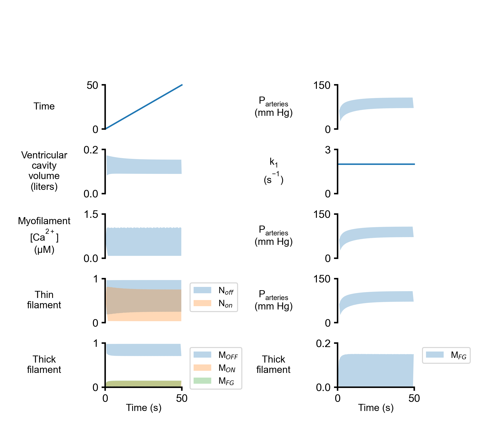

# Multipanel plots

## Overview
Multipanel plots are useful python-based functions for plotting numerous sub-plots within a single figure. This could be a special interest of biomedical-related scientists.

