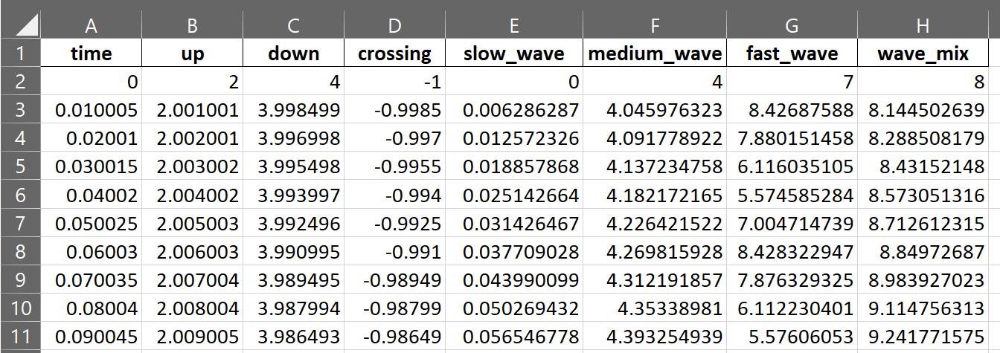

# Multipanel Numerical
{:.no_toc}

* TOC
{:toc}
## Overview
This python tool helps to develop multipanel plots in a single figure when variables are numerical. 


## Function
Returns a tuple that contains a handle to the produced pyplot figure and a handle to an array of the pyplot axes.

```python
PyCMLutil.plots.multi_panel.multi_panel_from_flat_data(
        data_file_string = [],
        excel_sheet = 'Sheet1',
        pandas_data = [],
        template_file_string=[],
        output_image_file_string = [],
        dpi = 300)
```
**Parameters:**

| **Key** | **Type** | **Comment** |
| ------ | ------- | ---------- |
| data_file_string | str, optional | Path to the data file (either in format of csv or xlsx). The default is []. |
| excel_sheet | str, optional | Excel sheet where the data are stored. The default is *Sheet1*. |
| pandas_data | Pandas DataFrame, optional | DataFrame containing the data. The default is []. |
| template_file_string | str, optional | Path to the .json structure file. The default is []. |
| output_image_file_string | str, optional | Path where the output plot is saved. The default is []. |
| dpi | int, optional | Image resolution. The default is 300. |


**Returns:**

(**figure**, **ax**)

| **Key** | **Comment** |
| ------ | ---------- |
| figure | Handle to the produced pyplot figure |
| ax | Handle to an array of the pyplot axes. |

### Data spread sheet
This function can reads data from stored in an excel spread sheet or Pandas DataFrame and generates the multipanel figure based on the **template** file. 

Inputted data must be structured similar to a Pandas [DataFrame](https://pandas.pydata.org/docs/reference/api/pandas.DataFrame.html). It should be a two-dimensional tabular data where each column represents a variable and each row represents a single observation for all variables. 



### Template file
Through the template file, the user can control the whole process of plotting a multipanel figure. The template file should be in [JSON](https://www.json.org/json-en.html)format and can contain a set of data blocks to adjust the default parameters. 
1. Section `panels`:
    The most important section of the **template** file can be the `panels` section. This section is an array of dictionaries in which each dictionary holds the plotting information of each single subplot or panel in the multipanel figure. The general structure of this section is shown in below. 

    ````javascript
    "panels":
        [
            {
                "column": 1,
                "x_field": "x-axis variable",
                "x_ticks": ["tick_1", "tick_2"],
                "x_label": "x-axis label",
                "y_info":
                {
                    "label": "Y Axis Label",
                    "scaling_type": "close_fit"
                    "series":
                    [
                        {
                            "field": "y_info_1",
                            "field_label": "Series_1"
                            "style": "line",
                            "scaling_factor": "autoscaling",
                            "log_display": false,
                            "field_color": "black",
                            
                        }
                    ]
                }
            }
        ]       
    ````
    All possible parameters for defining of a single subplot/ panel are described below.  

    | **Parameters** | **Type** | **Comment** |
        | ------ | ------- | ---------- |
        | column | int | Column index of the subplot. 1 represents the first column of subplots from the left hand side of the figure. |
        | x_field | str, optional | Name of the x-axis variable in data. If it is not defined, function uses the `global_x_field` in `x_display` section |
        | x_ticks | array, optional | List of x-axis tick locations. |
        | y_info | dict | Dictionary of parameters that are related to y-axis. | 
        | label | str, optional | Label for y-axis. |
        | scaling_type | str, optional | Mode of y-axis data scaling. Default value is `autoscaling` where it scales the y-axis data from zero-point and the most maximum of data (for negative values it would scale between zero and the minimum of dta). `close_fit` mode would scale data between the minimum and maximum of data. |
        | series | array | Series of y-axis information for each plot on a single subplot/panel. |
        | field | str, optional | Name of the y-axis variable in data. |
        | field_label | str, optional | Label for each plot. It will be used in the legend of the subplot. |
        | style | str, optional | Default is `line` where it uses [matplotlib.pyplot.plot](https://matplotlib.org/stable/api/_as_gen/matplotlib.pyplot.plot.html) function. The other style is `envelope` which plots the envelop of data using [matplotlib.patches.Polygon](https://matplotlib.org/stable/api/_as_gen/matplotlib.patches.Polygon.html) function. |
        | scaling_factor | float, optional | Multiplier for the y-axis data. Default is 1.|
        | log_display | boolean, optional | Default is `False`. Computes logarithm of y-axis with base of 10 if it is `True`.  |
        | field_color | str, optional | Color of plot. |

    - **Notes**: 
        1. To have multiple plots within a single subplot/panel you should define them within the `series` sub-section.
        2. To have multiple subplots/panels within a figure, you should define them with multiple dictionaries within the `panels` section. 

2. Section `formatting`: Formatting section is optional. It controls the general formatting of the figure with the following structure. If it is not defined, default values will be used for plotting of the figure.

    ````javascript
    "formatting":
    {
        "data_linewidth": 1.5,
        "fontname" : 'Arial',
        "axis_linewidth": 1.5,
        "x_label_fontsize": 12,
        "x_label_pad": 0,
        "y_label_rotation": 0,
        "y_label_fontsize": 12,
        "y_label_pad": 30,
        "legend_location": "upper left",
        "legend_bbox_to_anchor": [1.05, 1],
        "legend_fontsize": 9,
        "legend_handlelength": 1,
        "tick_fontsize": 11,
        "patch_alpha": 0.3,
        "max_rows_per_legend": 4,
        "palette": None
    }
    ````
    Formatting parameters are described in below table.

    | **Parameters** | **Type** | **Comment** |
        | ------ | ------- | ---------- |
        | data_linewidth | float, optional | Line width of plots. Default is 1.50. |
        | fontname | str, optional | Font name for all texts in the figure. Default is `Arial`. |
        | axis_linewidth | float, optional | Linewidth of axes. Default is 1.50. |
        | x_label_fontsize | float, optional | Font size of x-axis label. Default is 12.| 
        | x_label_pad | scalar, optional | Spacing in points from the x-axis bounding box including ticks and tick labels. |
        | y_label_rotation | float, optional | Angle in which the y-axis label is shown. Default is 0. |
        | y_label_fontsize | float, optional | Font size of y-axis label. Default is 12. |
        | y_label_pad | scalar, optional | Spacing in points from the y-axis bounding box including ticks and tick labels. |
        | legend_location | str, optional | The location of the legend. Default is `"upper left"`. Other options can be found on [matplotlib.pyplot.legend](https://matplotlib.org/stable/api/_as_gen/matplotlib.pyplot.legend.html). |
        | legend_bbox_to_anchor | str, optional | Box that is used to position the legend in conjunction with *legend_location*. This argument allows arbitrary placement of the legend. Default is `[1.05, 1]`. For more details visit [matplotlib.pyplot.legend](https://matplotlib.org/stable/api/_as_gen/matplotlib.pyplot.legend.html). |
        | legend_fontsize | float, optional | Font siz of legend. Default is 9. |
        | legend_handlelength | float, optional | The length of the legend handles, in font-size units. Default is 1. |
        | tick_fontsize | float, optional | Font siz of ticks. Default is 11. |
        | patch_alpha | float, optional | The alpha transparency of patches. Default is 0.3. |
        | max_rows_per_legend | int, optional | Maximum number of rows in the legend box. Default is 4 |
        | palette | str, optional | Name of the colormap in [matplotlib](https://matplotlib.org/stable/tutorials/colors/colormaps.html). |

3. Section `layout`: Similar to `formatting`, it is an optional section. It controls the layout of the figure. If it is not defined in the **template** file, default values will be used.

    ````javascript
    "layout":
    {
        "fig_width": 3.5,
        "panel_height" : 1,
        "top_margin": 0.1,
        "bottom_margin": 0.1,
        "left_margin": 0.1,
        "right_margin": 0.1,
        "grid_wspace": 0.1,
        "grid_hspace": 0.1  
    }
    ````
    Layout parameters are defined in below table. 

    | **Parameters** | **Type** | **Comment** |
        | ------ | ------- | ---------- |
        | fig_width | float, optional | Width of the figure. |
        | panel_height | float, optional | Height of each subplot/ panel in the figure. |
        | top_margin | float, optional | Layout magrgin at the top of the figure. |
        | bottom_margin | float, optional | Layout magrgin at the bottom of the figure. |
        | left_margin | float, optional | Layout magrgin at the left side of the figure. |
        | right_margin | float, optional | Layout magrgin at the right side of the figure. |
        | grid_wspace | float, optional | The amount of width reserved for space between subplots. |
        | grid_hspace | float, optional | The amount of height reserved for space between subplots. |

4. Section `x_display`: This section can be used to globally define the x-axis for all subplots/ panels.

    ````javascript
    "x_display":
    {
        "global_x_field": "",
        "global_x_ticks": ["tick_1", "tick_2"],,
        "label": "Time (s)"
    }
    ````

    | **Parameters** | **Type** | **Comment** |
        | ------ | ------- | ---------- |
        | global_x_field | str, optional | Name of the global x-axis variable in data. |
        | global_x_ticks | float, optional | List of x-axis tick locations. |
        | label | str, optional | Global label for x-axis. |

5. Section `annotations`: Using this section allows to annotate any subplot/ panel in a multipanel figure. 
    Right now, four types of annotations (`h_line`,`v_line`,`text`, and`box`) are supported. In the following json structure, examples are brough for each type of annotations. 

    As many as annotation is required can be added in this section. 

    ````javascript
    "annotations":
    [
        {
            "panel": 0,
            "type": "h_line",
            "y_value": 5,
            "linestyle": ":",
            "linewidth": 2,
            "color": "cyan"
        },
        {
            "panel": 0,
            "type": "v_line",
            "x_value": 5,
            "linestyle": ":",
            "linewidth": 2,
            "color": "cyan"
        },
        {
            "panel": 0,
            "type": "text",
            "x_coord": 10,
            "y_rel_coord": 1.3,
            "label": "Horizontal line \nfor this panel",
            "label_fontsize": 8,
            "label_color": "cyan"
        },
        {
            "panel": 2,
            "type": "box",
            "x_coord": 5,
            "width":15,
            "y_rel_coord": 1.1,
            "rel_height": 0.2,
            "linestyle": "-",
            "linewidth": 2,
            "face_color":"lightblue",
            "edge_color": "red"
        }
    ]
    ````

    | **Parameters** | **Type** | **Comment** |
    | ------ | ------- | ---------- |
    | panel | int or str | Panel/ subplot index, starting from 0, in which will be annotated. It is based on the order of panel data that are contained in `panels` section. For example, `"panel": 2` means the  third panel in `panels` section will be annotated. To assign an annotations to all subplots/ panels, alternatively, a keyword of `"all"` can be used.|
    | type | str | Type of annotation. It can be any of the following list: `"h_line"` : To annotate a horizontal line. `"v_line"` : To annotate a vertical line. `"text"` : To annotate a text. `"h_line"` : To annotate a box. |
    | y_value | float | The y-axis value in which the horizontal line would be added. It is only required  for `h_line` type of annotation. |
    | linestyle | str, optional | Line style for `h_line`, `v_line`, and frame `box` types of annotations. It can be changed according to [matplotlib](https://matplotlib.org/stable/gallery/lines_bars_and_markers/linestyles.html). Default is `"--"` or `"dashed"`. |
    | linewidth | float, optional | Line width for `h_line`, `v_line`, and frame `box` types of annotations. Default value is equalt to `data_linewidth` in the `formatting` section. |
    | color | str, optional | Line color for `h_line` or `v_line` types of annotation. |
    | x_value | float | The x-axis value in which the vertical line would be added. It is only required  for `v_line` type of annotation. |
    | x_coord | float | The x-axis coordination, in which the `text` or bottom-left corner of `box` annotations woul be placed on a subplot/ panel.|
    | y_rel_coord | scalar | The relative y-axis coordination, in which the `text` or bottom-left corner of `box` annotations woul be placed on a subplot/ panel. For example, `"y_rel_coord": 1` implies one times of amplitude above the reference y-axis point. Or `"y_rel_coord": -2` implies two times of mplitude below the reference y-axis point. |
    | label | str | Text label for `text` annotation. |
    | label_fontsize | float, optional | Font size of `text` annotation. |
    | label_color | str, optional | Color of `text` annotation. |
    | width | float | Width of the `box` annotation starting from the `x_coord`. |
    | rel_height | bool, optional | Height of `box` annotation relative to the amplitude of y-axis starting from the `y_rel_coord`. |
    | face_color | str, optional | Face color of the `box` annotation. Default is `None`. |
    | edge_color | str, optional | Color of `box` annotation frame. Default is `"black"`. |
